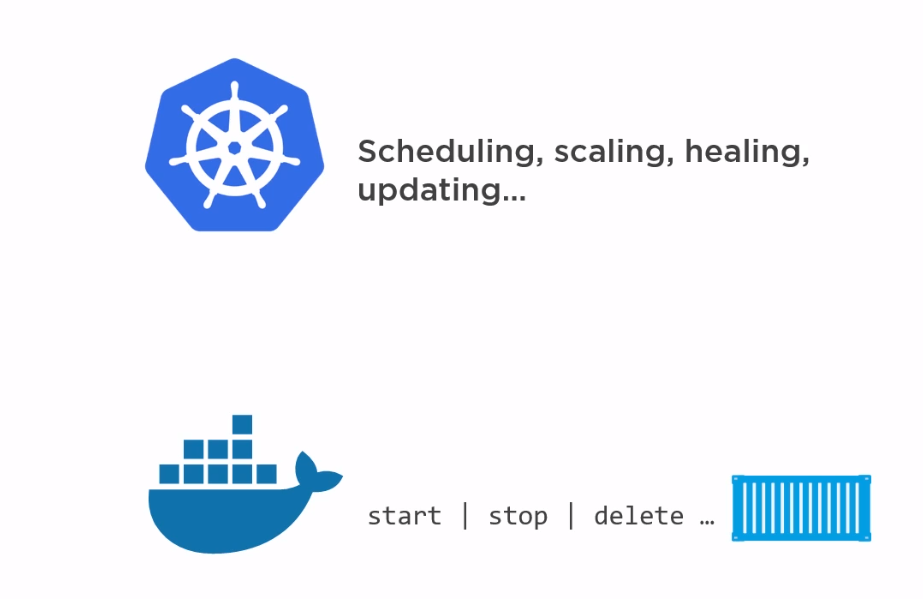
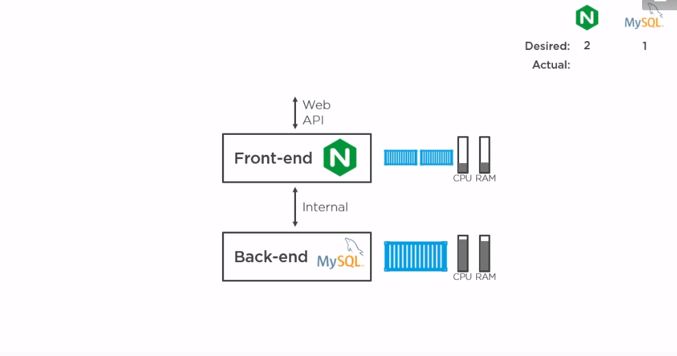
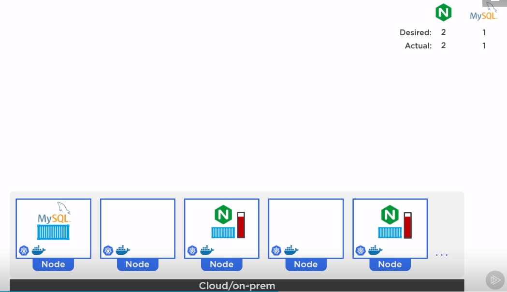
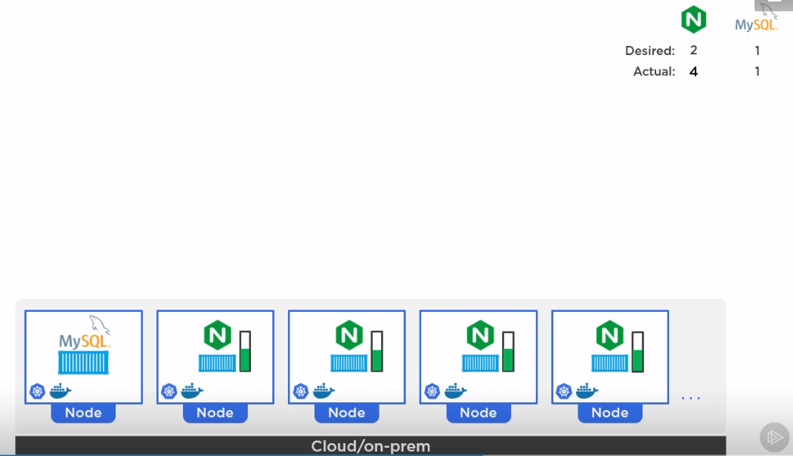
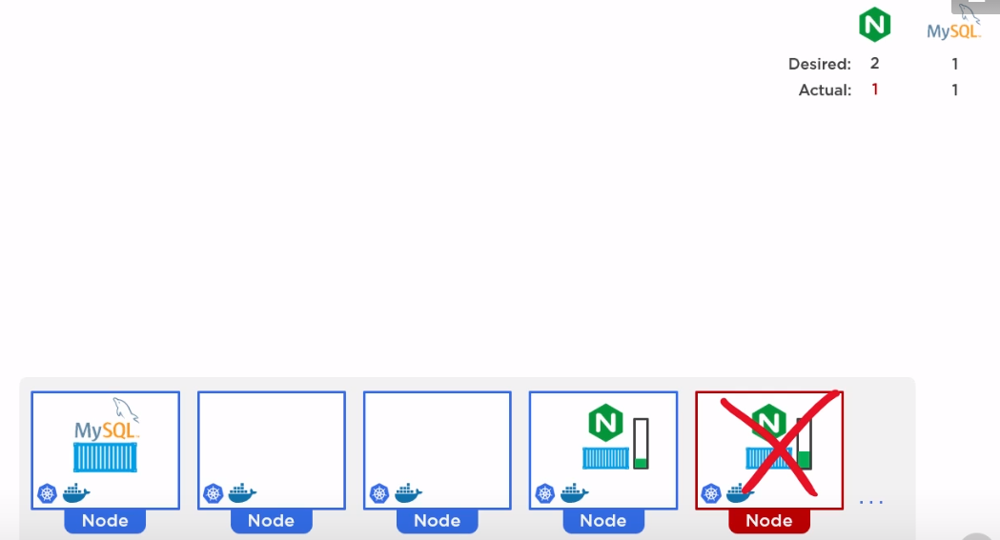
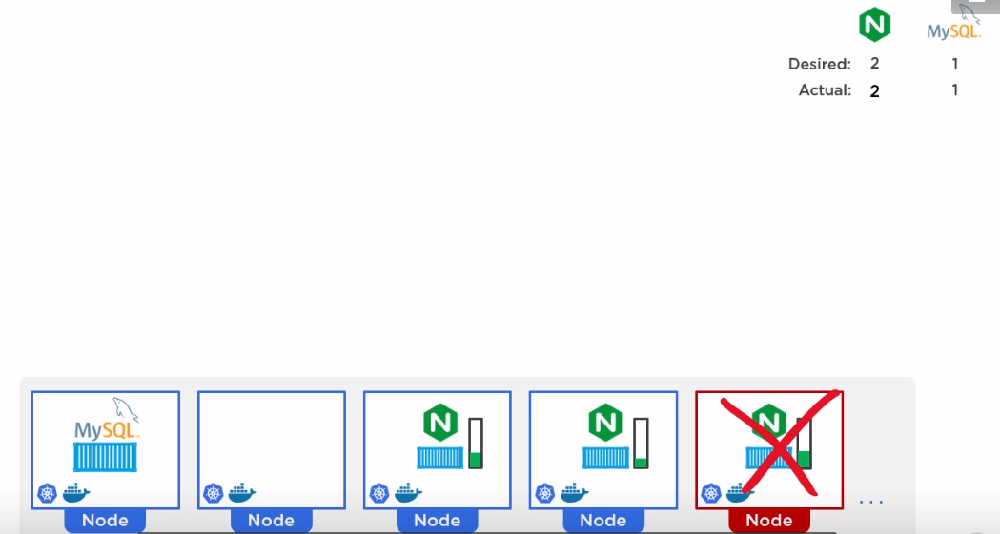
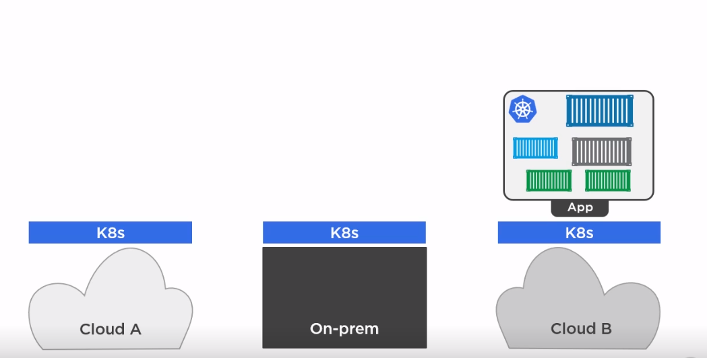

# En grundläggande kurs i Kubernetes

```
 _  __     _                          _            
| |/ /   _| |__   ___ _ __ _ __   ___| |_ ___  ___ 
| ' / | | | '_ \ / _ \ '__| '_ \ / _ \ __/ _ \/ __|
| . \ |_| | |_) |  __/ |  | | | |  __/ ||  __/\__ \
|_|\_\__,_|_.__/ \___|_|  |_| |_|\___|\__\___||___/


```
##### presenterad av Dominic Chan, dominic.chan@knowit.se

---

Mentimeter - gå till menti.com och ange koden: 4241 7027

---

| Namn     | AWS hostname                                        |
|----------|-----------------------------------------------------|
| Azeb     | ec2-16-170-222-98.eu-north-1.compute.amazonaws.com  |
| Dennis   | ec2-13-48-126-169.eu-north-1.compute.amazonaws.com  |
| Erik     | ec2-13-49-159-7.eu-north-1.compute.amazonaws.com    |
| Emelie   | ec2-13-50-17-29.eu-north-1.compute.amazonaws.com    |
| Johan B  | ec2-13-49-158-38.eu-north-1.compute.amazonaws.com   |
| Johan Å  | ec2-16-170-37-234.eu-north-1.compute.amazonaws.com  |
| Jonathan | ec2-13-51-36-156.eu-north-1.compute.amazonaws.com   |
| Patrik   | ec2-13-50-106-108.eu-north-1.compute.amazonaws.com  |
| Simon    | ec2-16-170-108-26.eu-north-1.compute.amazonaws.com  |
| Sofie    | ec2-13-50-14-227.eu-north-1.compute.amazonaws.com   |
| Louise B | ec2-13-51-44-60.eu-north-1.compute.amazonaws.com    |
| Louise J | ec2-13-50-15-99.eu-north-1.compute.amazonaws.com    |
| Josefine | ec2-13-48-124-85.eu-north-1.compute.amazonaws.com   |
| Emil Ö   | ec2-16-171-53-167.eu-north-1.compute.amazonaws.com  |
| Emil T   | ec2-13-53-136-42.eu-north-1.compute.amazonaws.com   |
| Olof     | ec2-13-49-148-31.eu-north-1.compute.amazonaws.com   |
| Frida    | ec2-16-171-46-218.eu-north-1.compute.amazonaws.com  |
| Jennifer | ec2-13-50-13-110.eu-north-1.compute.amazonaws.com   |
| John     | ec2-13-50-100-167.eu-north-1.compute.amazonaws.com  |
| Extra 1  | ec2-13-49-138-134.eu-north-1.compute.amazonaws.com  |
| Extra 2  | ec2-16-171-45-229.eu-north-1.compute.amazonaws.com  |
| Extra 3  | ec2-13-53-194-64.eu-north-1.compute.amazonaws.com   |
| Extra 4  | ec2-13-50-106-230.eu-north-1.compute.amazonaws.com  |
| Extra 5  | ec2-16-170-166-189.eu-north-1.compute.amazonaws.com |
| Extra 6  | ec2-13-49-125-91.eu-north-1.compute.amazonaws.com   |

---

# Vad är Docker?

- Containrar är som snabba och lättviktiga virtuella maskiner.
- Docker gör det enkelt att bygga och köra våra applikationer i containrar.
- docker start | stop | delete

---

# Vad är K8s

- Kubernetes (helmsman) "Rorsman" 
- Orkestrerar container via container runtime t.ex. Docker
- scheduling | scaling | healing | updating

---

# Google - containers


---

# Omega / Borg


---

# Cloud Native Opensource


---

# SSH till er AWS instans

`ssh -i ~/.ssh/aws-linux-demo.pem ubuntu@ubuntu@ec2-16-171-26-141.eu-north-1.compute.amazonaws.com`

---

# Installera Minikube

`cd knowit-kubernetes-kurs`
`cat minikube.sh`
`sudo chmod +x minikube.sh`
`./minikube.sh`

---

# Kubernetes vs Docker


---

# Control plane / Worker nodes


----

# Webbapplikation


----

# Kubernetes deployment


---

# Auto scaling


---

# Auto healing


---

# Auto healing


---

# Cloud ready


---

# DEMO

---

# PAUS

---

# HANDS ON

---

# Lista alla namespaces

Använd kommandot `kubectl get ns`

---

# Lista alla nodes

Använd kommandot `kubectl get nodes`

---

# Lista alla pods

Använd kommandot `kubectl get pods`

`kubectl get pods -n kube-system`

---

# Kör en deploy med Nginx

Kör kommandot `kubectl create deployment nginx-deploy --image=nginx`

---

# Lista deployment

Använd kommandot `kubectl get deployment`

---

# Exponera deployment genom att skapa en service

Kör kommandot `kubectl expose deployment nginx-deploy --port=8080`
`kubectl get svc nginx-deploy`

---

# Ändra targetPort till 80 och type: NodePort

`kubectl edit svc nginx-deploy`
`i` för Insert mode
Ändra targetPort till 80. Ändra type: ClusterIP till type: NodePort.
`ESC` och sedan `:wq!` för att spara och gå ut

---

# Skapa en proxy till klustret

Använd kommandot `minikube service nginx-deploy`

---

# Testa göra anrop till den nya deployment

Kör kommandot `curl <http://proxy-ip:port>`

---

# Skala upp deployment

Använd kommandot `kubectl scale deployment nginx-deploy --replicas=10`

---

# Skala ned deployment

Använd kommandot `kubectl scale deploment nginx-deploy --replicas=5`

---

# Ta bort en eller flera podar

Kör kommandot `kubectl get pods`
Använd kommandot `kubectl delete po <podnamn>` för att ta bort en pod.
Kör kommandot `kubectl get pods` igen för att se vad som hänt med poden.
Kör kommandot `kubectl delete po --all`. Alla podar tas bort.
Kör kommandot `kubectl get pods`. Vad händer med podarna.

---

# Ta bort service och deployment

Använd kommandot `kubectl delete svc nginx-deploy`
`kubectl delete deployment nginx-deploy`
`kubectl get svc` och `kubectl get deployment`

---

# Övningar:
1. Skapa och kör en deployment som får heta apache-deployment med imagen "httpd".
2. Exponera den nya deployment på port 8080. Editera servicen så att den får targetPort 80. Ändra från type: ClusterIP till type: NodePort.
3. Skapa en proxy till klustret med kommandot `minikube service apache-deployment` 
4. Testa att göra anrop till proxyadressen.
5. Skala upp deployment till 5 replicas
6. Skala ned depolyment till 2 replicas
7. Ta bort de skapade servicen och deployment.

---


# Avslut och utvärdering:

Mentimeter - gå till menti.com och ange koden: 2862 2580 

---
