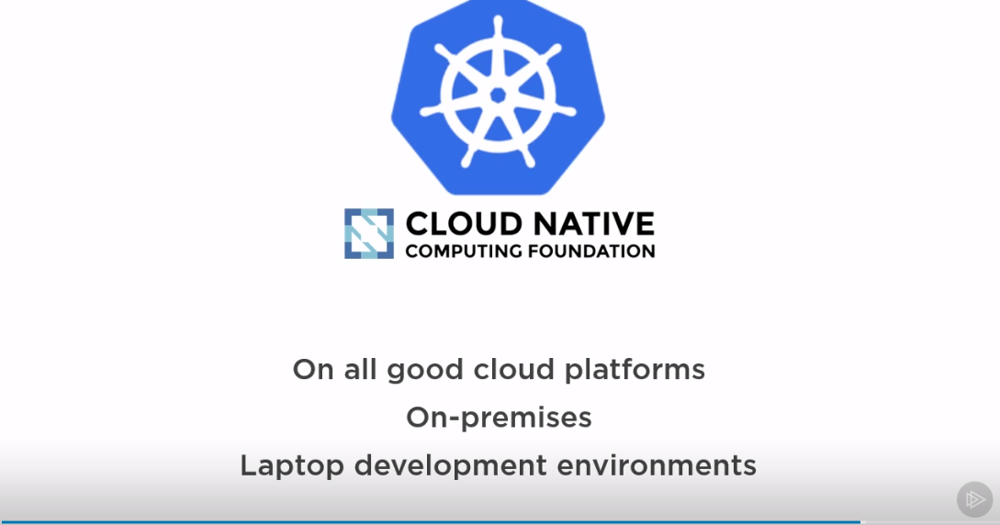

# En grundläggande kurs i Kubernetes

```
 _  __     _                          _            
| |/ /   _| |__   ___ _ __ _ __   ___| |_ ___  ___ 
| ' / | | | '_ \ / _ \ '__| '_ \ / _ \ __/ _ \/ __|
| . \ |_| | |_) |  __/ |  | | | |  __/ ||  __/\__ \
|_|\_\__,_|_.__/ \___|_|  |_| |_|\___|\__\___||___/


```
##### presenterad av Dominic Chan, dominic.chan@knowit.se

---

Mentimeter - gå till menti.com och ange koden: 4241 7027

---

| Deltagare 	| AWS host	|
|-----------	|----------	|
| Azeb      	|       	|
| Dennis    	|  	|
| Erik      	|  	|
| Emelie    	|  	|
| Johan B   	|  	|
| Johan Å   	|  	|
| Jonathan  	|  	|
| Patrik    	| 	|
| Simon     	|  	|
| Sofie     	|  	|
| Louise B  	|  	|
| Louise J  	|  	|
| Josefine  	|  	|
| Emil Ö    	|  	|
| Emil T    	|  	|
| Olof      	| 	|
| Frida     	|  	|
| Jennifer  	|  	|
| John      	| 	|
| Extra 1   	|  	|
| Extra 2   	| 	|
| Extra 3   	| 	|
| Extra 4   	| 	|
| Extra 5   	| 	|
| Extra 6   	| 	|

---

# Vad är Docker?

- Containrar är som snabba och lättviktiga virtuella maskiner.
- Docker gör det enkelt att bygga och köra våra applikationer i containrar.
- docker start | stop | delete

---

# Vad är K8s

- Kubernetes (helmsman) "Rorsman" 
- Orkestrerar container via container runtime t.ex. Docker
- deploy | scale | heal

---

# Google - containers


---

# Omega / Borg


---

# Cloud Native Opensource


---

# SSH till er AWS instans

`ssh -i ~/.ssh/aws-linux-demo.pem ubuntu@ubuntu@ec2-16-171-26-141.eu-north-1.compute.amazonaws.com`

---

# Installera Minikube

`cd knowit-kubernetes-kurs`
`cat minikube.sh`
`sudo chmod +x minikube.sh`
`./minikube.sh`

---

# Lista alla namespaces

Använd kommandot `kubectl get ns`

---

# Lista alla nodes

Använd kommandot `kubectl get nodes`

---

# Lista alla pods

Använd kommandot `kubectl get pods`

`kubectl get pods -n kube-system`

---

# Kör en deploy med Nginx

Kör kommandot `kubectl create deployment nginx-deploy --image=nginx`

---

# Lista deployment

Använd kommandot `kubectl get deployment`

---

# Exponera deployment genom att skapa en service

Kör kommandot `kubectl expose deployment nginx-deploy --port=8080`
`kubectl get svc nginx-deploy`

---

# Ändra targetPort till 80

`kubectl edit svc nginx-deploy`
`i` för Insert mode
`ESC` och sedan `:wq!` för att spara och gå ut

---

# Skapa en proxy till klustret

Använd kommandot ``

---

# Testa göra anrop till den nya deployment

Kör kommandot `curl localhost:8080`

---

# Skala upp deployment

Använd kommandot `kubectl scale deployment nginx-deploy --replicas=10`

---

# Skala ned deployment

Använd kommandot `kubectl scale deploment nginx-deploy --replicas=2`

---

# Ta bort en pod

Kör kommandot `kubectl get pods`
Använd kommandot `kubectl delete po <podnamn>` för att ta bort en pod.
Kör kommandot `kubectl get pods` igen för att se vad som hänt med poden.

---

# Ta bort service och deployment

Använd kommandot `kubectl delete svc nginx-deploy`
`kubectl delete deployment nginx-deploy`
`kubectl get svc` och `kubectl get deployment`

---

# Övningar:
1. Skapa och kör en deployment som får heta apache-deployment med imagen "httpd".
2. Exponera den nya deployment på port 8080. Editera servicen så att den får targetPort 80. Ändra från type: ClusterIP till type: NodePort.
3. Skapa en proxy till klustret med kommandot `minikube service apache-deployment` 
4. Testa att göra anrop till proxyadressen.
5. Skala upp deployment till 5 replicas
6. Skala ned depolyment till 2 replicas
7. Ta bort de skapade servicen och deployment.

---


# Avslut och utvärdering:

Mentimeter - gå till menti.com och ange koden: 2179 658 

---
